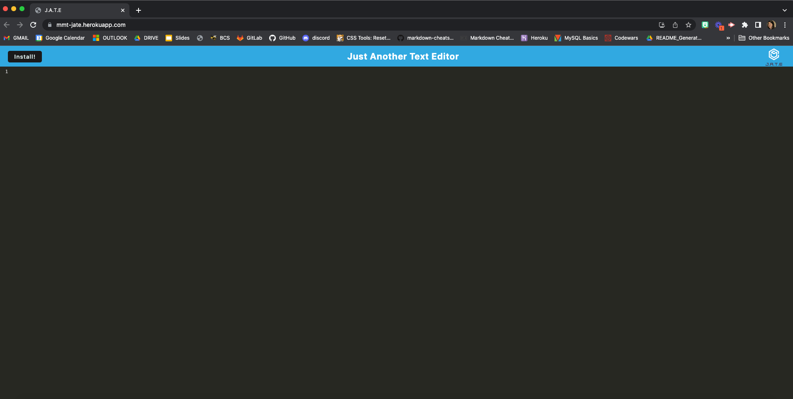
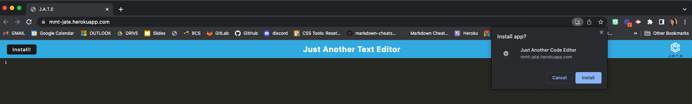
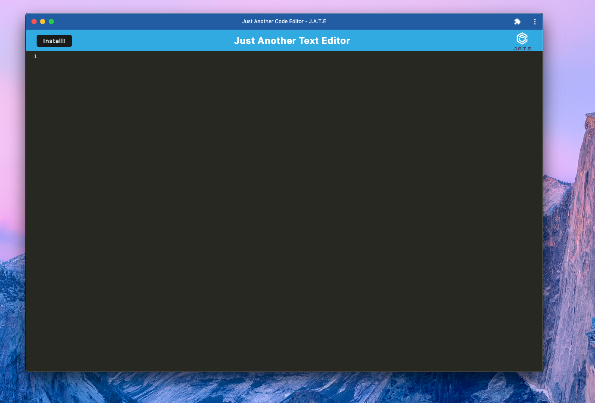

# Just Another Text Editor

## Table of Contents

- [Screenshots](#screenshots)
- [Description](#description)
- [Authors](#authors)
- [Usage](#usage)
- [Contributions](#contributions)
- [Questions](#questions)

## Screenshots

## Description

Just Another Text Editor is a single-page application that meets PWA criteria. This is a text-editor that you can use in a web browser. You can also install the app on your computer, and run it as a desktop app. This app stores data to an indexed database, allowing the user to save work on the text editor regardless of the location where they are running it.

## Authors

Code modified by Mary Margaret Taylor

## Usage

Visit the [Deployment Link](https://mmt-jate.herokuapp.com/) to run the application on the browser. Click "install" in the upper left hand corner, and proceed if you would like a downloaded version of the app on your computer. You can then use the app in either location!

## Contributions

This project is not accepting contributions at this time.

## Questions

If you have any questions, contact Mary Margaret Taylor at taylor.marymargaret@gmail.com. Visit the [GitHub repository link](https://github.com/mmtaylor7/PWA-Text-Editor) if you'd like!
